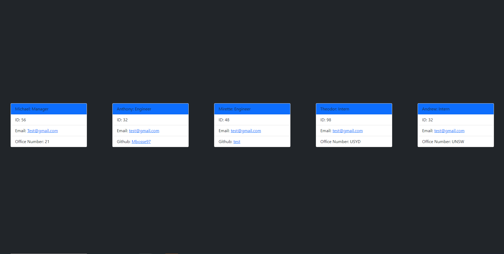

# Team View Generator

## Description 
The following repository uses node.js in order to take command line input from users and create a proffessionally styled HTML which displays each member of a given team, once their information has been receieved. each member will be displayed on their own card and shown on the one HTML file. 

---
## Contents
- [Description](#description)
- [Installation](#installation)
- [Usage](#usage)
- [Contributing](#contributing)
- [License](#license)
- [Questions](#questions)
- [Demo](#demo)

---
## Installation
The inquirer and jest packages will need to be installed before use of the code. "npm i inquirer" and "npm i jest" can be used in the command line in order to download the package

---
## Usage
within the command line users will be prompted to enter the details of their manager and office number, once this is complete, each team memeber can be added individually as either an intern or engineer. Once this is complete, users can enter that they have completed added employees and then a HTML page will be generated on within the repository. 

---
## Contributing
Michael Bosse

---
## License
No License

---
## Questions
Github - https://github.com/Mbosse97 

---
### Demo

Screenshot of Project Demo

Project Demo Link: https://drive.google.com/file/d/1gS-eFQvPAUIxfp_RTDRUWMJ6VmC2hs-h/view 